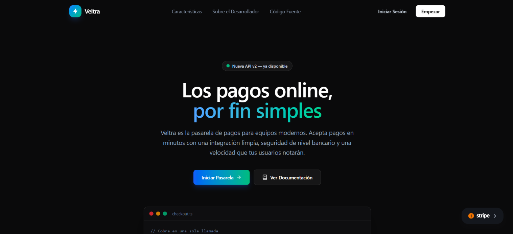
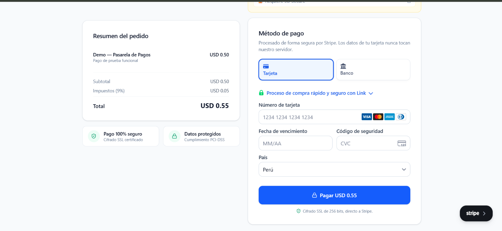
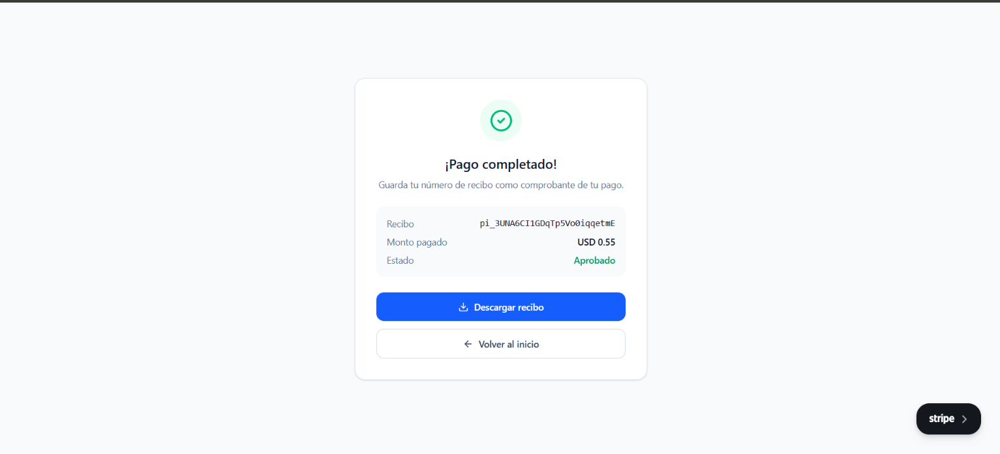
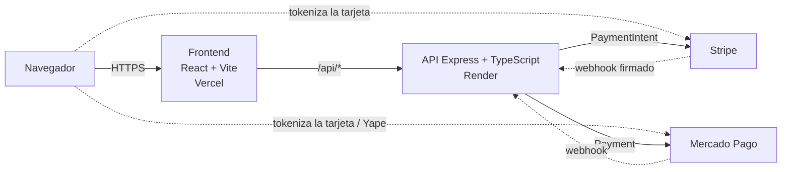

# Veltra — Pasarela de pagos demo

Checkout que acepta **tarjetas internacionales (Stripe)** y **pagos locales en soles para Perú (Mercado Pago con tarjeta y Yape)**, con un backend propio que calcula el monto y verifica los webhooks.

[](https://github.com/FernandoHernandez19/PAY-GATEWAY/actions/workflows/ci.yml)
[](https://pay-gateway-teal.vercel.app)
[](tsconfig.app.json)

## 👉 [**Abrir la demo en vivo**](https://pay-gateway-teal.vercel.app)

> ⏳ **Aviso:** la API corre en el plan gratuito de Render (`https://pay-gateway-77kg.onrender.com`). Si lleva un rato sin uso, la **primera petición puede tardar ~50 segundos** en despertar; después responde con normalidad. Todo funciona en **modo de prueba**: no se mueve dinero real.

## Capturas

| Landing | Checkout | Pago exitoso |
| :---: | :---: | :---: |
|  |  |  |

## Funcionalidades

- **Landing** con navegación, hero, sección de funcionalidades y footer (`src/components/landing`).
- **Checkout con dos proveedores** intercambiables mediante pestañas: *Tarjeta internacional* (Stripe Payment Element) y *Mercado Pago (Local)* (`src/pages/Checkout.tsx`).
- **Mercado Pago**: Payment Brick con tarjeta de crédito/débito y un formulario propio de **Yape** (celular + OTP), cobrando en soles.
- **Resumen del pedido** que se pide al servidor (`GET /api/order`); el frontend no define precios.
- **Estados de pago**: pantalla de procesamiento, de error con reintento y de éxito con **descarga del recibo en HTML** (`SuccessScreen.tsx`).
- **Panel "Modo demo"** en el checkout con los datos de prueba de cada proveedor.
- **Webhooks** de Stripe (con verificación de firma) y de Mercado Pago, que consultan/registran el resultado real del pago en el servidor.

## Arquitectura



El navegador envía los datos sensibles directamente a Stripe / Mercado Pago (tokenización) y a la API solo llegan tokens; la API crea el cobro y recibe los webhooks de vuelta.

## Decisiones técnicas

- **El monto lo calcula el servidor, no el cliente.** Stripe y Mercado Pago ignoran cualquier importe enviado por el navegador. → `server/src/lib/orders.ts`, `server/src/routes/paymentIntent.ts`, `server/src/routes/mercadopago.ts`.
- **Tokenización en el navegador.** Los datos de tarjeta nunca pasan por el backend propio: Stripe Elements y el Payment Brick de Mercado Pago generan el token/confirmación. → `src/components/checkout/CheckoutForm.tsx`, `MercadoPagoPayment.tsx`.
- **`express.raw` antes de `express.json` en el webhook de Stripe.** La firma se verifica sobre los bytes exactos del cuerpo; si se parseara antes, dejaría de coincidir. → `server/src/app.ts`, `server/src/routes/webhook.ts`.
- **Clave de idempotencia** (`randomUUID`) en cada creación de pago de Mercado Pago/Yape para evitar cobros duplicados por reintentos. → `server/src/routes/mercadopago.ts`, `yape.ts`.
- **Errores amigables sin exponer detalles técnicos.** El error completo se registra en el servidor y al cliente se le devuelve un mensaje claro (incluido el motivo de rechazo mapeado). → `server/src/routes/mercadopago.ts`, `yape.ts`.
- **App separada del arranque** (`app.ts` exporta la app; `index.ts` hace `listen`) para poder probar los endpoints con Supertest sin abrir un puerto. → `server/src/app.ts`, `server/src/index.ts`.
- **Moneda local con tasa fija (solo demo).** El total en soles se calcula con `USD_TO_PEN_RATE`; una integración real usaría un tipo de cambio en vivo. → `server/src/lib/orders.ts`.

## Calidad

- **TypeScript `strict`** en frontend y servidor; `grep -rn ": any\|as any" src server/src` no devuelve resultados.
- **Tests: 106 en total** (`npm run test` en cada paquete): **58** en el frontend (7 archivos, Vitest + Testing Library) y **48** en el servidor (5 archivos, Vitest + Supertest). Los SDK de Stripe y Mercado Pago se simulan con `vi.mock`: ningún test llama a APIs reales ni usa claves reales.
- **Cobertura** de `server/src/lib` (`npm run test:coverage`): **93,75 % de líneas** (umbral mínimo configurado: 70 %).
- **CI en cada PR y push a `main`** (GitHub Actions): lint, typecheck, tests y build del frontend; typecheck, tests con cobertura y build del servidor.

## Datos de prueba

> El panel **"Modo demo"** del checkout muestra estos datos con botón de copiar.

**Stripe** (cualquier fecha futura, CVC y código postal):

| Número | Resultado |
| --- | --- |
| `4242 4242 4242 4242` | Pago exitoso |
| `4000 0000 0000 0002` | Pago rechazado |
| `4000 0025 0000 3155` | Requiere 3D Secure |

**Mercado Pago Perú — tarjetas** (vencimiento `11/30`):

| Tarjeta | Número | Titular | Resultado |
| --- | --- | --- | --- |
| Visa crédito | `4009 1753 3280 6176` | `APRO` | Aprobado |
| Visa crédito | `4009 1753 3280 6176` | `OTHE` | Rechazado |
| Mastercard débito | `5178 7816 2220 2455` | `APRO` / `OTHE` | Aprobado / Rechazado |

**Yape** (modo prueba):

| Celular | OTP | Resultado |
| --- | --- | --- |
| `111111111` | `123456` | Aprobado |
| `111111112` | `123456` | Rechazado |

## Correr en local

**Requisitos:** Node.js 22 (ver `.nvmrc`; mínimo 22.12) y cuentas de prueba de [Stripe](https://dashboard.stripe.com/test/apikeys) y [Mercado Pago Developers](https://www.mercadopago.com.pe/developers).

```bash
# 1) Servidor (http://localhost:4000)
cd server
cp .env.example .env      # completa tus claves de PRUEBA
npm install
npm run dev

# 2) Frontend (http://localhost:5173), en otra terminal, desde la raíz
cp .env.example .env      # completa tus claves públicas de PRUEBA
npm install
npm run dev
```

**Variables de entorno** (los `.env.example` solo traen marcadores, nunca claves reales):

| Variable | Dónde | Descripción |
| --- | --- | --- |
| `VITE_STRIPE_PUBLISHABLE_KEY` | Frontend | Clave pública de Stripe (`pk_test_...`) |
| `VITE_MP_PUBLIC_KEY` | Frontend | Public key de Mercado Pago (`TEST-...`) |
| `VITE_API_URL` | Frontend | URL de la API (`http://localhost:4000` en local) |
| `STRIPE_SECRET_KEY` | Servidor | Clave secreta de Stripe (`sk_test_...`) |
| `STRIPE_WEBHOOK_SECRET` | Servidor | Secreto de firma del webhook (`whsec_...`) |
| `MP_ACCESS_TOKEN` | Servidor | Access token de Mercado Pago (`TEST-...`) |
| `PORT` | Servidor | Puerto de la API (`4000`) |
| `CLIENT_URL` | Servidor | Origen del frontend permitido por CORS (`http://localhost:5173`) |

**Webhook de Stripe en local** (opcional, con [Stripe CLI](https://docs.stripe.com/stripe-cli)):

```bash
stripe listen --forward-to localhost:4000/api/webhook
```

Copia el `whsec_...` que imprime a `STRIPE_WEBHOOK_SECRET`.

**Scripts útiles**

| Comando | Raíz (frontend) | `server/` |
| --- | --- | --- |
| `npm run test` | Vitest + Testing Library | Vitest + Supertest |
| `npm run typecheck` | `tsc -b` | `tsc --noEmit` |
| `npm run build` | `vite build` | `tsc` → `dist/` (`npm start`) |
| `npm run lint` | ESLint | — |
| `npm run test:coverage` | — | Cobertura v8 |

## Estructura del proyecto

```text
.
├── src/                    # Frontend (React + TypeScript)
│   ├── components/
│   │   ├── landing/        # Navbar, Hero, Features, Footer…
│   │   └── checkout/       # Formularios de pago, resumen, estados
│   ├── pages/              # Landing y Checkout
│   ├── lib/                # Cliente de la API, formato, Stripe
│   └── types/              # Tipos compartidos (pedido, pago, pasos)
├── server/
│   └── src/
│       ├── app.ts          # Configura la app (CORS, middlewares, rutas)
│       ├── index.ts        # Arranque (listen)
│       ├── lib/            # Montos del pedido, cliente de Stripe
│       └── routes/         # order, paymentIntent, webhook, mercadopago, yape
├── docs/screenshots/       # Capturas del README
└── .github/workflows/      # CI
```

## Qué aprendí

- **TypeScript con SDKs de pago:** derivar tipos del propio SDK (`ComponentProps<typeof Payment>`, `Stripe.Event`) en lugar de duplicarlos, y acotar entradas externas con `unknown` y *narrowing* en vez de `any`.
- **Webhooks y firmas:** por qué el cuerpo debe llegar crudo para verificar la firma y cómo probarlo con firmas generadas localmente.
- **Testing con mocks:** simular Stripe y Mercado Pago para tests deterministas, probar componentes como lo haría el usuario y endpoints con Supertest.
- **CI:** automatizar lint, tipos, tests y build en cada PR, y leer un fallo desde la pestaña Actions.
- **Depurar integraciones en sandbox:** distinguir errores del proveedor, de datos de prueba y del propio código, y no filtrar detalles técnicos al usuario.

## Próximos pasos

- Persistir los pedidos y su estado de pago (hoy los webhooks solo registran el resultado).
- Reemplazar la tasa de cambio fija por un tipo de cambio en vivo.
- Agregar tests end-to-end del flujo de checkout.

## Autor

**Luis Fernando Hernández Chunga** · [LinkedIn](https://www.linkedin.com/in/fernando-hern%C3%A1ndez-5b1148367/) · [GitHub @FernandoHernandez19](https://github.com/FernandoHernandez19)
